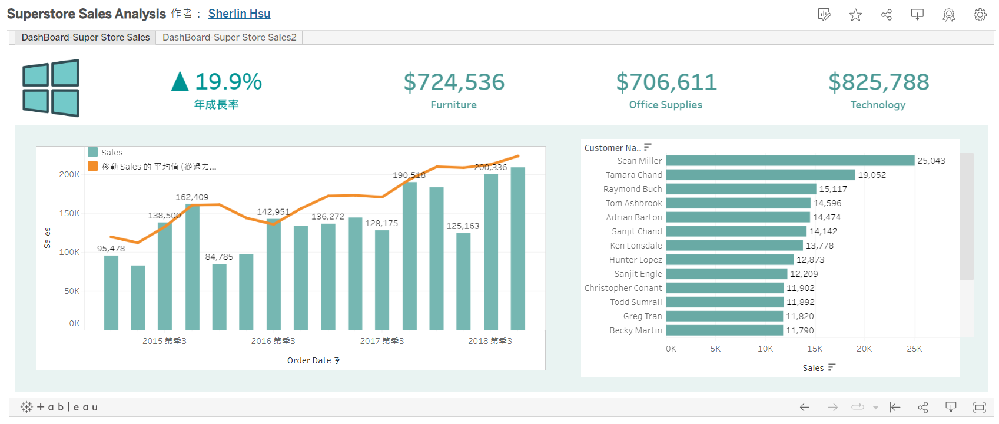

## 賣場銷售狀況
### 想了解的問題有....?
* **公司成長幅度**
* **產品類別營收狀況**
* **公司逐季銷售狀況**
* **客戶銷售狀況**
* **公司歷年銷售趨勢**
* **產品銷售佔比**
* **全球銷售分布**

### 使用技術:
* **Data Cleaning: Python Pandas,Numpy**
* **Data visualization:Python Matplotlib,seaborn；Tableau**

### 成果:
[觀看儀錶板](https://public.tableau.com/shared/JPRJ3Y9TC?:display_count=n&:origin=viz_share_link)

